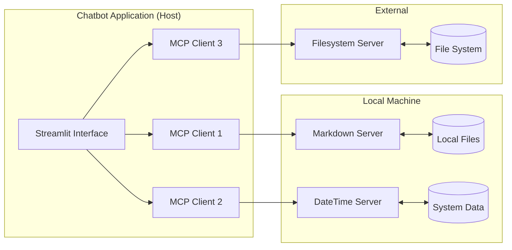
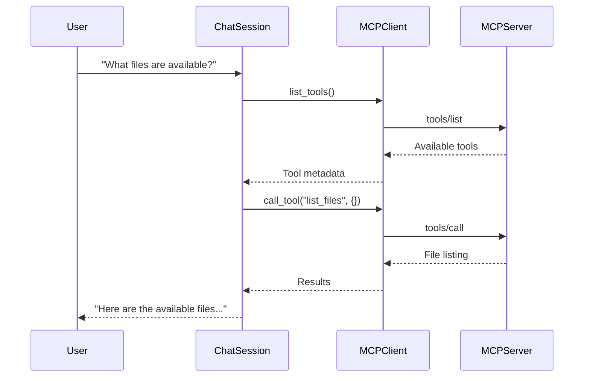

# Model Context Protocol Chatbot

## 🌟 Overview

This project demonstrates a production-ready MCP client implementation that acts as an interactive chatbot interface. The Model Context Protocol (MCP) is an open standard that provides a unified way for AI applications to securely connect to diverse data sources and tools, similar to how USB-C provides standardized connectivity for devices.

### What is Model Context Protocol?

The **Model Context Protocol (MCP)** is an open protocol that standardizes how applications provide context to LLMs. It follows a client-server architecture where:

- **MCP Host**: Application like this chatbot that contain MCP clients and coordinate AI integration
- **MCP Client**: Protocol client that maintain 1:1 connections with servers  
- **MCP Servers**: Lightweight programs exposing specific capabilities through standardized interfaces



## 🏗️ Architecture

### Core Components

This project implements the complete MCP architecture with the following key components:

#### 1. **Host Application** (`chatbot.py`)
The main Streamlit application that acts as the MCP host:
- **Role**: Coordinates MCP client and manages the overall UX/UI
- **Responsibilities**: 
  - User interface and chat management
  - LLM integration and response streaming
  - Client lifecycle management
  - Security and authorization control
  - Context aggregation across multiple servers

#### 2. **MCP Client Layer** (`src/mcp/client.py`)
Individual clients that maintain isolated server connections:
- **Architecture**: Each client maintains a 1:1 stateful session with one server
- **Capabilities**: 
  - Protocol negotiation and capability exchange
  - Bidirectional message routing
  - Tool discovery and execution
  - Subscription and notification management
  - Security boundary enforcement

#### 3. **Chat Session Orchestrator** (`src/mcp/session.py`)
The intelligent session manager that coordinates between users, LLMs, and tools:
- **Core Function**: Orchestrates multi-turn conversations with dynamic tool integration
- **Key Features**:
  - Automatic tool call detection and extraction from LLM responses
  - Parallel tool execution across multiple MCP servers
  - Response streaming with real-time workflow visualization
  - Error handling and retry mechanisms
  - Message history management

#### 4. **LLM Integration Layer** (`src/model/`)
Pluggable LLM client architecture supporting multiple providers:
- **Current Support**: OpenAI (GPT-4o, GPT-4o-mini)
- **Planned**: Anthropic Claude, Google Gemini
- **Features**: Standardized interface for seamless provider switching

#### 5. **MCP Server Implementations** (`src/mcp/servers/`)
Custom MCP servers that expose domain-specific capabilities:
- **Markdown Processor**: Text processing and markdown manipulation
- **DateTime Processor**: Time-based operations and scheduling
- **Filesystem**: File operations (using official MCP filesystem server)

### Protocol Implementation

This implementation follows the [MCP specification](mcp-docs/sections/specification.md) and includes:

#### **Capability Negotiation**
As defined in the [MCP architecture](mcp-docs/sections/architecture.md), clients and servers explicitly declare supported features:

```python
# Example from our implementation
async def initialize(self) -> None:
    """Initialize server connection with capability negotiation"""
    server_params = StdioServerParameters(
        command=command,
        args=self.config["args"],
        env=environment_vars
    )
    session = await ClientSession(read, write)
    await session.initialize()  # Performs capability negotiation
```

#### **Tool Discovery and Execution**
Following the [MCP tools specification](mcp-docs/sections/tools.md):

```python
async def list_tools(self) -> List[MCPTool]:
    """Discover available tools with metadata"""
    tools_response = await self.session.list_tools()
    return [MCPTool(tool.name, tool.description, tool.inputSchema) 
            for tool in tools_response]

async def execute_tool(self, tool_name: str, arguments: dict) -> Any:
    """Execute tool with retry mechanism and error handling"""
    return await self.session.call_tool(tool_name, arguments)
```

## 🚀 Key Features

### 1. **Multi-Server Integration**
- Simultaneous connections to multiple MCP servers
- Automatic tool discovery and consolidation
- Load balancing and failover capabilities

### 2. **Intelligent Tool Orchestration**  
- Automatic tool call detection from natural language
- JSON-based tool invocation with schema validation
- Parallel tool execution for improved performance
- Comprehensive error handling and retries

### 3. **Real-Time Workflow Visualization**
- Live streaming of LLM responses
- Interactive workflow step display
- Tool execution progress tracking
- Detailed error reporting and debugging

### 4. **Secure Multi-Tenant Architecture**
- Isolated client connections per server
- Configurable security policies
- Resource cleanup and connection management
- Session state isolation

### 5. **Extensible Provider Support**
- Pluggable LLM provider architecture
- Runtime provider switching
- Standardized configuration management

## 📁 Project Structure

```
ubs-mcp-poc/
├── chatbot.py                 # Main Streamlit application (Host)
├── servers_config.json        # MCP server configuration
├── environment.yml           # Conda environment setup
├── src/
│   ├── mcp/                  # MCP implementation
│   │   ├── client.py         # MCP client implementation
│   │   ├── session.py        # Chat session orchestrator
│   │   ├── tool.py          # Tool abstraction layer
│   │   └── servers/         # Custom MCP servers
│   │       ├── markdown_processor.py
│   │       └── datetime_processor.py
│   ├── model/               # LLM integration layer
│   │   ├── factory.py       # Provider factory
│   │   ├── base.py         # Base LLM interface
│   │   └── oai.py          # OpenAI implementation
│   ├── config.py           # Configuration management
│   ├── workflow.py         # Workflow visualization
│   └── consts.py           # Project constants
└── mcp-docs/               # MCP protocol documentation
    └── sections/           # Detailed specification docs
```

## ⚙️ Configuration

### MCP Server Configuration (`servers_config.json`)
```json
{
    "mcpServers": {
        "markdown_processor": {
            "command": "python",
            "args": ["src/mcp/servers/markdown_processor.py"]
        },
        "datetime_processor": {
            "command": "python", 
            "args": ["src/mcp/servers/datetime_processor.py"]
        },
        "filesystem": {
            "command": "npx",
            "args": ["-y", "@modelcontextprotocol/server-filesystem", "/path/to/directory"]
        }
    }
}
```

### Environment Setup
```bash
# Create conda environment
conda env create -f environment.yml
conda activate ubs-mcp-poc

# Install additional dependencies
pip install mcp[cli] openai-agents python-dotenv streamlit
```

## 🎯 Usage

### Starting the Application
```bash
streamlit run chatbot.py
```

### Example Interactions

1. **File Operations**
   - "What files are in the root directory?"
   - "Create a new markdown file with project documentation"

2. **Data Processing** 
   - "Process this markdown content and extract headers"
   - "Convert this text to a structured format"

3. **Time-Based Operations**
   - "What's the current time in UTC?"
   - "Schedule a reminder for next week"

### Tool Call Flow

The system automatically detects when tools are needed and executes them transparently:

1. **User Input**: Natural language query
2. **LLM Processing**: Determines if tools are needed
3. **Tool Discovery**: Finds relevant tools across all connected servers
4. **Execution**: Calls appropriate tools with extracted parameters
5. **Response Generation**: Processes results into natural language

## 🔧 How MCP Works in This Implementation

### Connection Lifecycle

Following the [MCP lifecycle specification](mcp-docs/sections/lifecycle.md):

1. **Initialization Phase**
   ```python
   # Host creates clients for each configured server
   for name, config in server_configs.items():
       client = MCPClient(name, config)
       await client.initialize()  # Establishes connection
   ```

2. **Capability Exchange**
   ```python
   # Server declares its capabilities
   await session.initialize()  # Negotiates supported features
   tools = await session.list_tools()  # Discovers available tools
   ```

3. **Active Session**
   ```python
   # Normal operation with requests/responses
   result = await session.call_tool(tool_name, arguments)
   ```

4. **Cleanup**
   ```python
   # Proper resource cleanup
   await client.cleanup()
   ```

### Message Flow

Our implementation follows the standard [MCP message patterns](mcp-docs/sections/messages.md):



## 🔐 Security Considerations

Following [MCP security best practices](mcp-docs/sections/security-best-practices.md):

### 1. **Server Isolation**
- Each MCP client maintains separate connections
- No cross-server data leakage
- Individual security policies per server

### 2. **Tool Authorization**
- Human-in-the-loop tool execution approval
- Clear visual indicators for tool invocations
- Configurable security policies

### 3. **Data Protection**
- Local data processing when possible
- Minimal context sharing with servers
- Secure credential management

## 🛠️ Development

### Adding New MCP Servers

1. **Create Server Implementation**
   ```python
   # src/mcp/servers/my_server.py
   class MyMCPServer:
       async def handle_tool_call(self, name: str, args: dict):
           # Implementation
   ```

2. **Update Configuration**
   ```json
   {
     "mcpServers": {
       "my_server": {
         "command": "python",
         "args": ["src/mcp/servers/my_server.py"]
       }
     }
   }
   ```

3. **Register Tools**
   - Tools are automatically discovered
   - No client-side changes needed

### Adding New LLM Providers

1. **Implement Provider Interface**
   ```python
   # src/model/new_provider.py
   class NewProviderClient(BaseLLMClient):
       async def generate_response(self, messages: List[dict]) -> str:
           # Provider-specific implementation
   ```

2. **Update Factory**
   ```python
   # src/model/factory.py
   def create_llm_client(provider: str) -> BaseLLMClient:
       if provider == "new_provider":
           return NewProviderClient()
   ```

## 📚 Next Steps

In the following messages, we'll dive deeper into:

1. **Detailed component documentation**
2. **Advanced MCP concepts and implementation details**
3. **Tool development guides**
4. **Performance optimization strategies**
5. **Troubleshooting and debugging**
6. **Extending the architecture**
