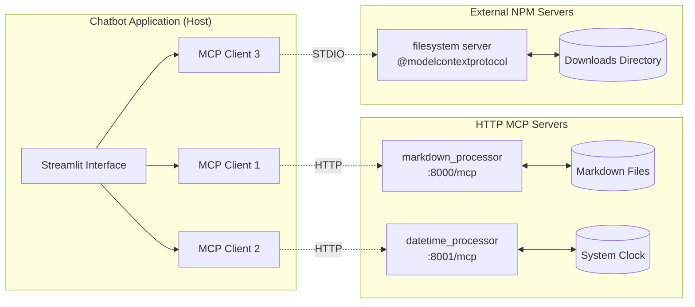
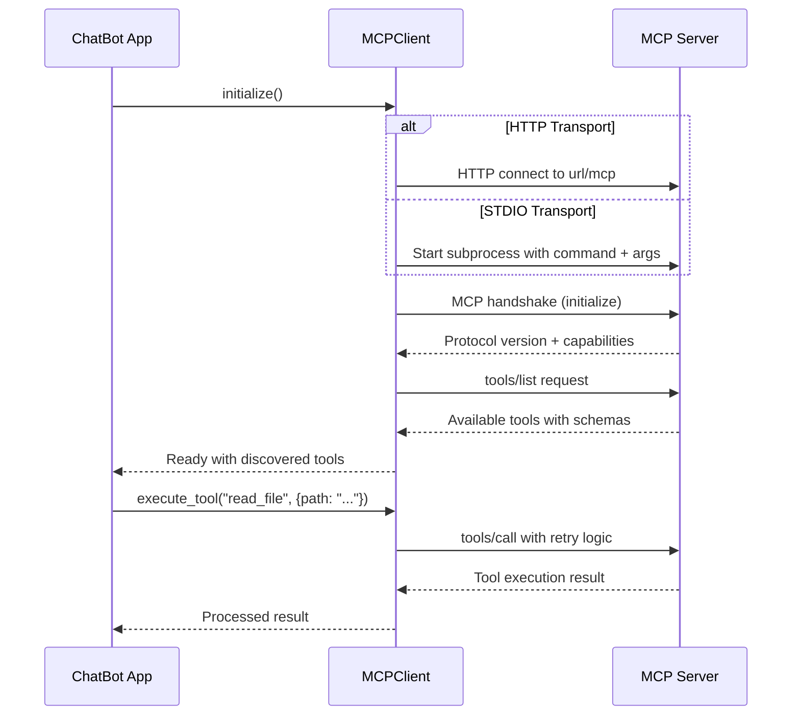
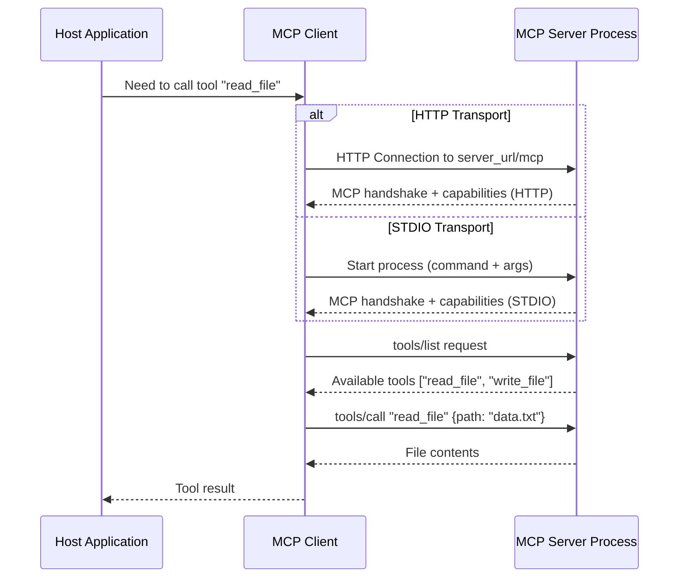
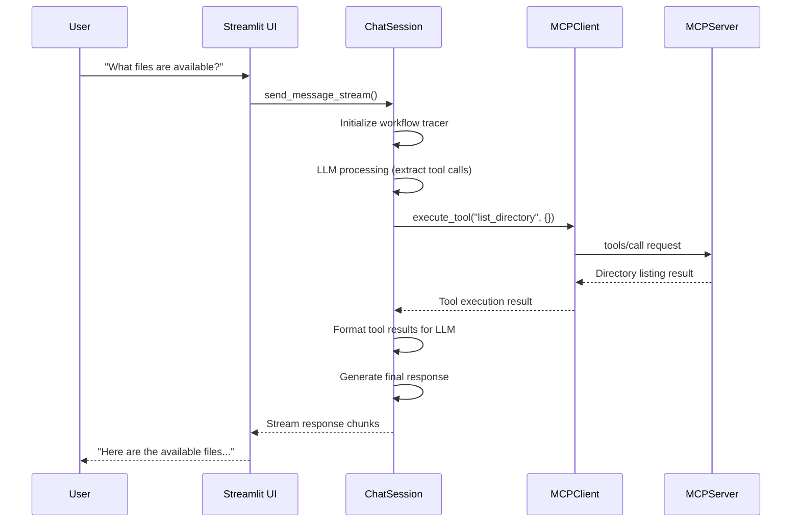

# Model Context Protocol Chatbot

## 🌟 Overview

This project demonstrates a production-ready MCP client implementation that acts as an interactive chatbot interface. The Model Context Protocol (MCP) is an open standard that provides a unified way for AI applications to securely connect to diverse data sources and tools, similar to how USB-C provides standardized connectivity for devices.

### What is Model Context Protocol?

The **Model Context Protocol (MCP)** is an open protocol that standardizes how applications provide context to LLMs. It follows a client-server architecture where:

- **MCP Host**: Application like this chatbot that contain MCP clients and coordinate AI integration
- **MCP Client**: Protocol client that maintain 1:1 connections with servers  
- **MCP Servers**: Lightweight programs exposing specific capabilities through standardized interfaces



## 🚀 Quick Start

### 1. Environment Setup
```bash
# Create and activate conda environment
conda env create -f environment.yml
conda activate ubs-mcp-poc
```

### 2. Configuration
```bash
# Set up required environment variable in your .env file
LLM_API_KEY=your_azure_openai_api_key_here

# The servers_config.json is already configured for HTTP transport
# Model selection is REQUIRED through the UI agent configuration - no environment variables
```

### 3. Run the Application
```bash
# Start HTTP MCP servers first
python run_http_servers.py

# In a new terminal, run the chatbot
streamlit run chatbot.py
```

## 🏗️ Architecture

### Core Components

This project implements the complete MCP architecture with the following key components:

#### 1. **Host Application Layer**
The complete user interface and application orchestration layer:

**Main Entry Point** (`chatbot.py`):
- **Role**: Lightweight coordinator and entry point (54 lines)
- **Responsibilities**: 
  - Application initialization and configuration
  - Session state management delegation
  - Component orchestration
  - Main event loop coordination

**UI Components** (`src/ui/`):
- **Components** (`components.py`): Interactive Streamlit components (381 lines)
  - Chat display and history management
  - Agent configuration interface
  - Sidebar controls and tool visualization
  - Workflow progress display
- **Manager** (`manager.py`): Session state initialization and management (94 lines)
  - Streamlit session state setup
  - Application state persistence
  - Configuration management

**Chat Processing** (`src/chat/processor.py`):
- **Core Function**: Processes user messages and orchestrates agent responses (485 lines)
- **Key Features**:
  - Agent configuration and personality management
  - Streaming response generation with workflow visualization
  - Tool execution integration via ChatSession
  - Real-time UI updates and progress tracking
  - Error handling and user feedback

#### 2. **MCP Client Layer** (`src/mcp/client.py`)

**🔗 Core Responsibility: One Client ↔ One Server Communication**

Each `MCPClient` manages a single connection to one MCP server, following the official 1:1 relationship pattern. The client automatically detects and supports both **STDIO** and **HTTP** transports based on configuration.

##### **🏗️ Basic Architecture Flow**



##### **💡 Core Implementation Logic**

**Step 1: Connection Setup (Auto-Transport Detection)**
```python
class MCPClient:
    async def initialize(self):
        # 1. Auto-detect transport type from config
        if "url" in self.config:
            # HTTP transport - connect to running server
            transport = await streamablehttp_client(
                url=self.config["url"],
                headers=self.config.get("headers"),
                timeout=timedelta(seconds=self.config.get("timeout", 30))
            )
            read, write, get_session_id = transport
        else:
            # STDIO transport - start server process
            server_process = start_server_process(self.config)
            transport = await stdio_client(server_process)
            read, write = transport
        
        # 2. MCP handshake - exchange protocol versions
        session = ClientSession(read, write)
        await session.initialize()  # ← MCP protocol negotiation
        
        # 3. Discover what tools this server provides
        tools_response = await session.list_tools()
        self.available_tools = parse_tools(tools_response)
```

**Step 2: Tool Execution**
```python
async def execute_tool(self, tool_name, arguments):
    # Validate tool exists
    if tool_name not in self.available_tools:
        raise ValueError(f"Tool {tool_name} not available")
    
    # Execute with retry logic
    for attempt in range(retries):
        try:
            # Send MCP tools/call request
            result = await self.session.call_tool(tool_name, arguments)
            return result
        except Exception as e:
            if attempt < retries - 1:
                await asyncio.sleep(backoff_delay)  # Retry with backoff
            else:
                raise e
```

##### **🎯 Key MCP Concepts in Action**

**Tool Discovery Pattern**
```python
# Each client discovers its server's tools independently
async def discover_tools(self):
    """What can this specific server do?"""
    response = await self.session.list_tools()
    
    # Example response processing:
    # [{name: "read_file", description: "...", schema: {...}},
    #  {name: "write_file", description: "...", schema: {...}}]
    
    self.tools = [MCPTool(name=t.name, 
                         description=t.description,
                         schema=t.inputSchema) 
                 for t in response.tools]
```

**Resource Management Pattern**
```python
# Clean startup/shutdown lifecycle
async def __aenter__(self):
    await self.initialize()
    return self

async def __aexit__(self, exc_type, exc_val, exc_tb):
    await self.cleanup()  # Always cleanup server processes

# Usage:
async with MCPClient("filesystem", config) as client:
    tools = await client.list_tools()
    result = await client.execute_tool("read_file", {"path": "/etc/hosts"})
    # Auto-cleanup happens here
```

##### **🔄 Multi-Client Orchestration**

**How Multiple Clients Work Together**
```python
# In ChatSession - the orchestrator
class ChatSession:
    def __init__(self, clients: List[MCPClient]):
        self.clients = clients  # e.g., [filesystem_client, datetime_client, web_client]
        self.tool_routing = {}  # tool_name -> which_client
    
    async def initialize(self):
        # 1. Initialize each client separately
        for client in self.clients:
            await client.initialize()
            
            # 2. Build unified tool map
            for tool in await client.list_tools():
                self.tool_routing[tool.name] = client
        
        # Result: {"read_file": filesystem_client, 
        #          "get_time": datetime_client,
        #          "web_search": web_client}
    
    async def execute_any_tool(self, tool_name, args):
        # Route to correct client automatically
        client = self.tool_routing[tool_name]
        return await client.execute_tool(tool_name, args)
```

##### **🛠️ Real Usage Example**

```python
# Complete flow from user query to tool execution
async def handle_user_request():
    # Setup: Multiple servers for different capabilities (auto-transport detection)
    config = {
        "filesystem": {"command": "npx", "args": ["@modelcontextprotocol/server-filesystem"]},
        "datetime_processor": {"url": "http://127.0.0.1:8001/mcp", "timeout": 30},  # HTTP server
        "markdown_processor": {"url": "http://127.0.0.1:8000/mcp", "timeout": 30},  # HTTP server
    }
    
    # Create clients (one per server) - auto-detects transport type
    fs_client = MCPClient("filesystem", config["filesystem"])                    # STDIO
    dt_client = MCPClient("datetime_processor", config["datetime_processor"])    # HTTP
    md_client = MCPClient("markdown_processor", config["markdown_processor"])    # HTTP
    
    # Initialize connections (transport handled automatically)
    await fs_client.initialize()  # ← Starts filesystem server via STDIO
    await dt_client.initialize()  # ← Connects to HTTP datetime_processor server
    await md_client.initialize()  # ← Connects to HTTP markdown_processor server
    
    # Now we have access to all tools from all servers
    fs_tools = await fs_client.list_tools()    # ["read_file", "write_file", "list_dir"]
    dt_tools = await dt_client.list_tools()    # ["get_time", "format_date"]
    md_tools = await md_client.list_tools()    # ["read_markdown", "write_markdown"]
    
    # Execute tools through appropriate clients (same API regardless of transport)
    files = await fs_client.execute_tool("list_dir", {"path": "/home"})
    time = await dt_client.execute_tool("get_time", {"timezone": "UTC"})
    content = await md_client.execute_tool("read_markdown", {"path": "README.md"})
```

**Why This Architecture?**
- ✅ **Isolation**: Each server runs independently, can't interfere with others
- ✅ **Composability**: Add/remove servers without affecting others  
- ✅ **Security**: Each server has its own permissions and scope
- ✅ **Reliability**: If one server fails, others keep working
- ✅ **Scalability**: Easy to add new capabilities by adding new servers

#### 2. **Chat Session Orchestrator** (`src/mcp/session.py`)
The intelligent session manager that coordinates between users, LLMs, and tools:
- **Core Function**: Orchestrates multi-turn conversations with dynamic tool integration
- **Key Features**:
  - Automatic tool call detection and extraction from LLM responses
  - Parallel tool execution across multiple MCP servers
  - Response streaming with real-time workflow visualization
  - Error handling and retry mechanisms
  - Message history management

#### 3. **MCP Tools Manager** (`src/mcp/manager.py`)
Caching and management layer for MCP tools across servers:
- **Core Function**: Efficient tool discovery and caching for Streamlit sessions
- **Features**:
  - Automatic transport type detection (HTTP/STDIO)
  - Tools caching for performance
  - Error handling and configuration validation
  - Session state integration

#### 4. **LLM Integration Layer** (`src/model/`)
Pluggable LLM client architecture supporting multiple providers:
- **Current Support**: OpenAI (GPT-4o, GPT-4o-mini)
- **Planned**: Anthropic Claude, Google Gemini
- **Features**: Standardized interface for seamless provider switching

#### 5. **MCP Server Layer** (`src/mcp/servers/`)

**🖥️ Core Responsibility: Lightweight Programs Exposing Specific Capabilities**

MCP servers are standalone programs that run in separate processes and expose tools, resources, and prompts through the standardized MCP protocol.

##### **🏗️ Basic Server Communication Flow**



##### **💡 Core Server Concepts**

**Tools - Functions LLMs Can Execute**
```python
@mcp.tool()
def calculate(operation: str, a: float, b: float) -> dict:
    """Perform basic math operations"""
    if operation == "add":
        return {"result": a + b}
    elif operation == "multiply":
        return {"result": a * b}
    else:
        return {"error": "Unknown operation"}
```

**Resources - Data Access Points**
```python
# Resources are like "files" the LLM can read
# Examples: configuration files, API data, database records
@mcp.resource("config://settings")
async def get_settings():
    return {"theme": "dark", "language": "en"}
```

**Prompts - Reusable Templates** 
```python
# Pre-written prompts for common tasks
@mcp.prompt("summarize_code")
def code_summary_prompt(code: str):
    return f"Please summarize this code and identify any issues:\n\n{code}"
```

##### **🔧 Creating a Simple Server**

**Step 1: Basic Server Structure**
```python
# my_server.py - Following our actual server pattern
from mcp.server.fastmcp import FastMCP

# Initialize server with HTTP transport (as used in our servers)
mcp = FastMCP("my-calculator", port=8002)

@mcp.tool()
def add_numbers(a: float, b: float) -> float:
    """Add two numbers together"""
    return a + b

@mcp.tool() 
def get_time() -> str:
    """Get current time"""
    from datetime import datetime
    return datetime.now().isoformat()

# Run server with HTTP transport (like our actual servers)
if __name__ == "__main__":
    mcp.run(transport="streamable-http")  # HTTP transport on specified port
```

**Step 2: Add to Configuration**
```json
{
    "mcpServers": {
        "calculator": {
            "url": "http://127.0.0.1:8002/mcp",
            "timeout": 30
        }
    }
}
```

**Alternative: STDIO Configuration (if you modify the server to use STDIO)**
```json
{
    "mcpServers": {
        "calculator": {
            "command": "python",
            "args": ["my_server.py"]
        }
    }
}
```


##### **🔄 Server Lifecycle in Host**

**How Servers Integrate**
```python
# Host application startup process:
async def initialize_mcp_ecosystem():
    servers = {}
    
    # 1. Read server configuration
    config = load_servers_config()
    
    # 2. Start each server process
    for name, server_config in config.items():
        # Start: python my_server.py  
        process = start_server_process(server_config)
        
        # 3. MCP handshake via STDIO
        client = MCPClient(name, process)
        await client.initialize()
        
        # 4. Discover available tools
        tools = await client.list_tools()
        
        servers[name] = {
            "client": client,
            "tools": tools  # ["add_numbers", "get_time"]
        }
    
    return servers  # Ready for LLM to use!
```

**Tool Routing** (From `src/mcp/session.py`)
```python
# When LLM wants to call a tool (actual implementation):
async def _execute_tool_call(self, tool_call_data: Dict[str, Any]) -> ToolCall:
    tool_name = tool_call_data["name"]
    arguments = tool_call_data["arguments"]
    
    # 1. Find which client has this tool (from tool_routing_map)
    if tool_name not in self.tool_routing_map:
        raise ValueError(f"Tool '{tool_name}' not available")
    
    client = self.tool_routing_map[tool_name]
    
    # 2. Execute with retry and error handling
    try:
        result = await client.execute_tool(tool_name, arguments)
        return ToolCall(tool=tool_name, arguments=arguments, result=result)
    except Exception as e:
        return ToolCall(tool=tool_name, arguments=arguments, error=str(e))
```

**Why This Architecture?**
- ✅ **Isolation**: Each server runs separately, failures don't cascade
- ✅ **Language Flexibility**: Write servers in Python, Node.js, Go, etc.
- ✅ **Simple Protocol**: Just JSON over STDIO - easy to implement
- ✅ **Auto-Discovery**: Tools automatically appear in host application
- ✅ **Composability**: Mix different servers for different capabilities

### Protocol Implementation

This implementation follows the [MCP specification](mcp-docs/sections/specification.md) and includes:

#### **Capability Negotiation**
As defined in the [MCP architecture](mcp-docs/sections/architecture.md), clients and servers explicitly declare supported features:

```python
# Example from our implementation
async def initialize(self) -> None:
    """Initialize server connection with capability negotiation"""
    server_params = StdioServerParameters(
        command=command,
        args=self.config["args"],
        env=environment_vars
    )
    session = await ClientSession(read, write)
    await session.initialize()  # Performs capability negotiation
```

#### **Tool Discovery and Execution**
Following the [MCP tools specification](mcp-docs/sections/tools.md):

```python
async def list_tools(self) -> List[MCPTool]:
    """Discover available tools with metadata"""
    tools_response = await self.session.list_tools()
    return [MCPTool(tool.name, tool.description, tool.inputSchema) 
            for tool in tools_response]

async def execute_tool(self, tool_name: str, arguments: dict) -> Any:
    """Execute tool with retry mechanism and error handling"""
    return await self.session.call_tool(tool_name, arguments)
```

## 🚀 Key Features

### 1. **Multi-Server Integration**
- Simultaneous connections to multiple MCP servers
- Automatic tool discovery and consolidation
- Load balancing and failover capabilities
- Mix STDIO and HTTP servers in the same application

### 2. **Intelligent Tool Orchestration**  
- Automatic tool call detection from natural language
- JSON-based tool invocation with schema validation
- Parallel tool execution for improved performance
- Comprehensive error handling and retries

### 3. **Real-Time Workflow Visualization**
- Live streaming of LLM responses
- Interactive workflow step display
- Tool execution progress tracking
- Detailed error reporting and debugging

### 4. **Secure Multi-Tenant Architecture**
- Isolated client connections per server
- Configurable security policies
- Resource cleanup and connection management
- Session state isolation

### 5. **Extensible Provider Support**
- Pluggable LLM provider architecture
- Runtime provider switching
- Standardized configuration management

## 📁 Project Structure

```
ubs-mcp-poc/
├── chatbot.py                 # Main Streamlit application (Host)
├── servers_config.json        # MCP server configuration (STDIO & HTTP)
├── run_http_servers.py        # Helper script to run HTTP servers
├── example_http_usage.py      # HTTP transport examples
├── environment.yml           # Conda environment setup
├── src/
│   ├── mcp/                  # MCP implementation
│   │   ├── client.py         # MCP client implementation
│   │   ├── session.py        # Chat session orchestrator
│   │   ├── manager.py        # MCP tools caching and management
│   │   ├── tool.py          # Tool abstraction layer
│   │   └── servers/         # Custom MCP servers
│   │       ├── markdown_processor.py  # FastMCP markdown server
│   │       └── datetime_processor.py  # FastMCP datetime server
│   ├── chat/                # Chat processing layer
│   │   └── processor.py     # Core chat processing logic (485 lines)
│   ├── ui/                  # User interface components
│   │   ├── components.py    # Streamlit UI components
│   │   └── manager.py       # Session state management
│   ├── model/               # LLM integration layer
│   │   ├── factory.py       # Provider factory
│   │   ├── base.py         # Base LLM interface
│   │   └── oai.py          # OpenAI implementation
│   ├── config.py           # Configuration management
│   ├── workflow.py         # Workflow visualization
│   └── consts.py           # Project constants
└── mcp-docs/               # MCP protocol documentation
    └── sections/           # Detailed specification docs
```

## ⚙️ Configuration

### MCP Server Configuration (`servers_config.json`)

The configuration supports both STDIO and HTTP transports with automatic detection:

```json
{
    "mcpServers": {
        "markdown_processor": {
            "url": "http://127.0.0.1:8000/mcp",
            "timeout": 30
        },
        "datetime_processor": {
            "url": "http://127.0.0.1:8001/mcp",
            "timeout": 30
        },
        "filesystem": {
            "command": "npx",
            "args": ["-y", "@modelcontextprotocol/server-filesystem", "/path/to/directory"]
        }
    }
}
```

**Transport Auto-Detection:**
- **HTTP**: Configuration contains `"url"` → connects to running HTTP server
- **STDIO**: Configuration contains `"command"` → starts server as subprocess

**HTTP Configuration Options:**
- `url`: Server endpoint (required)
- `headers`: Optional HTTP headers for authentication
- `timeout`: Request timeout in seconds (default: 30)


## 🎯 Usage

### Option 1: HTTP Transport (Recommended for Production)

1. **Start HTTP MCP Servers:**
   ```bash
   # Start all servers as persistent HTTP services
   python run_http_servers.py
   ```

2. **Run the Chatbot:**
   ```bash
   streamlit run chatbot.py
   ```

### Option 2: STDIO Transport (Alternative for Development)

**Note:** Our custom servers are designed for HTTP transport. To use STDIO, you'd need to modify them to remove the `transport="streamable-http"` parameter.

1. **Update Configuration:** Change `servers_config.json` to use STDIO:
   ```json
   {
       "mcpServers": {
           "markdown_processor": {
               "command": "python",
               "args": ["src/mcp/servers/markdown_processor.py"]
           },
           "datetime_processor": {
               "command": "python",
               "args": ["src/mcp/servers/datetime_processor.py"]
           }
       }
   }
   ```

2. **Modify servers** to remove HTTP transport (change `mcp.run(transport="streamable-http")` to `mcp.run()`)

3. **Run the Chatbot:**
   ```bash
   streamlit run chatbot.py
   ```

### Testing HTTP Transport
```bash
# Test HTTP transport functionality
python example_http_usage.py
```

### Tool Call Flow

The system automatically detects when tools are needed and executes them transparently:

1. **User Input**: Natural language query in Streamlit chat interface
2. **Chat Processing**: `src/chat/processor.py` handles the message and agent interaction
3. **LLM Processing**: Determines if tools are needed via `ChatSession`
4. **Tool Discovery**: `MCPManager` provides cached tools from all connected servers
5. **Tool Routing**: `ChatSession` routes calls to appropriate MCP clients
6. **Execution**: MCP clients execute tools on their respective servers
7. **Response Generation**: Results processed and streamed back to UI with workflow visualization

## 🔧 How MCP Works in This Implementation

### Connection Lifecycle

Following the [MCP lifecycle specification](mcp-docs/sections/lifecycle.md):

1. **Initialization Phase**
   ```python
   # MCP Manager loads and caches tools from all configured servers
   # Located in src/mcp/manager.py
   async def get_mcp_tools():
       tools_dict = {}
       for name, srv_config in server_config["mcpServers"].items():
           client = MCPClient(name, srv_config)
           await client.initialize()  # Auto-detects HTTP/STDIO transport
           tools = await client.list_tools()
           tools_dict[name] = {"tools": tools, "transport": transport_type, "config": srv_config}
       return tools_dict
   ```

2. **Capability Exchange**
   ```python
   # Server declares its capabilities
   await session.initialize()  # Negotiates supported features
   tools = await session.list_tools()  # Discovers available tools
   ```

3. **Active Session**
   ```python
   # Normal operation with requests/responses
   result = await session.call_tool(tool_name, arguments)
   ```

4. **Cleanup**
   ```python
   # Proper resource cleanup
   await client.cleanup()
   ```

### Message Flow

Our implementation follows the standard [MCP message patterns](mcp-docs/sections/messages.md):



## 🔐 Security Considerations

Following [MCP security best practices](mcp-docs/sections/security-best-practices.md):

### 1. **Server Isolation**
- Each MCP client maintains separate connections
- No cross-server data leakage
- Individual security policies per server

### 2. **Tool Authorization**
- Human-in-the-loop tool execution approval
- Clear visual indicators for tool invocations
- Configurable security policies

### 3. **Data Protection**
- Local data processing when possible
- Minimal context sharing with servers
- Secure credential management
